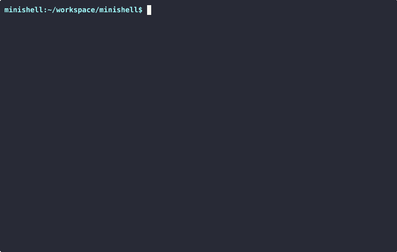

# minishell


A minimal shell implementation inspired by **bash**, built as a team project at [Hive Helsinki](https://www.hive.fi/) (42 Network). The shell processes user input through a **Lexer → Parser → Expander → Executor** pipeline.

---

## Demo



---

## Architecture

```
                         ┌─────────────────────────────┐
                         │        User Input            │
                         └─────────────┬───────────────┘
                                       │
                                       ▼
                         ┌─────────────────────────────┐
                         │          Lexer               │
                         │  (Tokenization, Quote state) │
                         └─────────────┬───────────────┘
                                       │  Token List
                                       ▼
                         ┌─────────────────────────────┐
                         │          Parser              │
                         │  (AST Build, Redirections)   │
                         └─────────────┬───────────────┘
                                       │  Command Table
                                       ▼
                         ┌─────────────────────────────┐
                         │         Expander             │
                         │  ($VAR expansion, Quote      │
                         │   removal, Retokenization)   │
                         └─────────────┬───────────────┘
                                       │  Expanded Commands
                                       ▼
                         ┌─────────────────────────────┐
                         │         Executor             │
                         │  (fork/exec, Pipes, FD mgmt, │
                         │   Builtins, Heredoc via pipe) │
                         └─────────────────────────────┘
```

---

## Features

| Category | Details |
|---|---|
| **Command Execution** | PATH lookup, absolute/relative path resolution |
| **Pipes** | Multiple pipes (`cmd1 \| cmd2 \| cmd3 \| ...`) |
| **Redirections** | `>` (output), `>>` (append), `<` (input), `<<` (heredoc) |
| **Variable Expansion** | `$VAR`, `$?` (last exit status) |
| **Quoting** | Single quotes (literal), double quotes (with expansion) |
| **Builtins** | `echo`, `cd`, `pwd`, `export`, `unset`, `env`, `exit` |
| **Signal Handling** | `Ctrl+C` (SIGINT), `Ctrl+D` (EOF), `Ctrl+\` (SIGQUIT) — context-aware behavior (interactive / executing / heredoc) |
| **Heredoc** | Implemented via pipe fd — no temporary files |

---

## Build & Run

### Prerequisites

- GCC or Clang
- GNU Make
- `readline` library (`libreadline-dev`)

### Build

```bash
git clone https://github.com/Hyeon-coder/minishell.git
cd minishell
make
```

### Run

```bash
./minishell
```

### Clean

```bash
make clean    # Remove object files
make fclean   # Remove object files and binary
make re       # Rebuild from scratch
```

---

## Key Challenges & What I Learned

### 1. Heredoc FD Management
Heredocs are implemented using **pipes instead of temporary files**. All heredocs must be pre-processed before the pipeline executes so that file descriptors are set up in the correct order. This required careful fd lifecycle management across forked processes.

### 2. Context-Aware Signal Handling
Signal behavior differs between **interactive mode**, **child process execution**, and **heredoc input**. A global state flag tracks the current context, allowing the shell to switch between ignoring, default-handling, or custom-handling each signal appropriately.

### 3. Quote & Variable Expansion Interaction
Single quotes suppress all expansion, while double quotes allow `$VAR` expansion. The Lexer must precisely track the quote state so that the Expander knows which tokens to expand. Edge cases like `"$VAR"'$VAR'` within a single argument required careful boundary tracking.

### 4. Team Interface Design
Midway through development, a Parser interface change broke the Executor integration. We resolved this by **defining interfaces first** (data structures, function signatures) and implementing independently against those contracts — a valuable lesson in collaborative C development.

---

## License

This project was developed as part of the 42 curriculum at Hive Helsinki.
